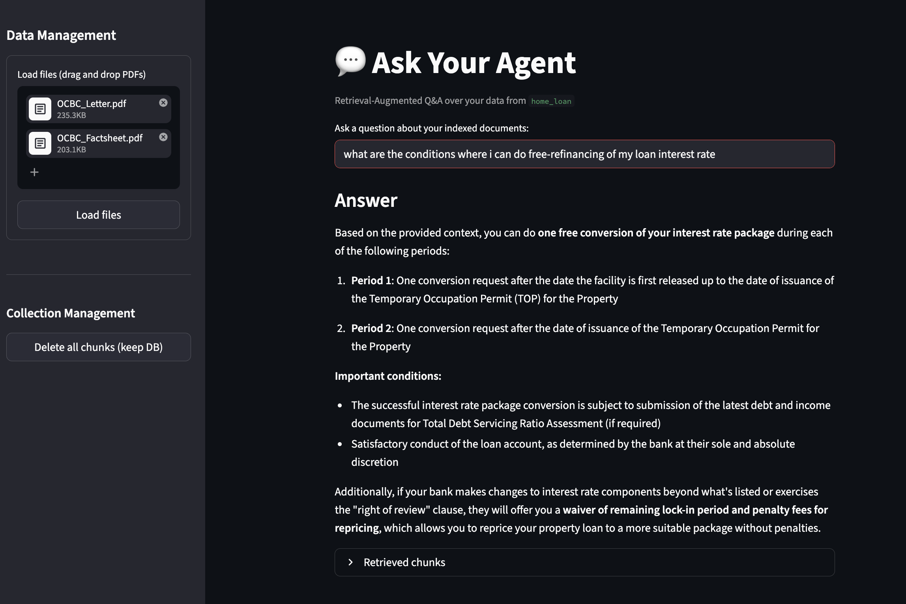

# RAG Agent (PDF Q&A with Streamlit + Chroma)

A simple Retrieval-Augmented Generation (RAG) app that lets you:

- Upload one or more PDF files
- Chunk and index them into a local Chroma vector store
- Ask questions in a Streamlit UI
- Get answers grounded in retrieved document chunks

The app uses OpenAI embeddings and a chat model through LangChain.

## Preview



## How It Works

1. **Upload PDFs** from the sidebar.
2. PDFs are temporarily saved, loaded with `PyPDFLoader`, then split with `RecursiveCharacterTextSplitter` (`chunk_size=1000`, `chunk_overlap=200`).
3. Chunks are stored in a Chroma collection (`langchain-chroma`) at `PERSIST_DIRECTORY`.
4. On question input, the app retrieves top-`k=4` chunks and builds a grounded prompt.
5. The chat model generates an answer, and retrieved chunks are shown for traceability.

## Tech Stack

- `streamlit` for UI
- `langchain` + `langchain-openai`
- `langchain-chroma` (vector store)
- `langchain-community` (`PyPDFLoader`)
- `python-dotenv` for environment variables

## Prerequisites

- Python 3.10+ recommended
- An OpenAI API key

## Setup

```bash
python -m venv .venv
source .venv/bin/activate
pip install -r requirements.txt
```

Create a `.env` file in the project root:

```env
OPENAI_API_KEY=your_openai_api_key
EMBEDDING_MODEL=text-embedding-3-small
CHAT_MODEL=gpt-4o-mini
COLLECTION_NAME=index
PERSIST_DIRECTORY=./db/index
```

## Run

```bash
streamlit run main.py
```

Then open the local Streamlit URL shown in your terminal (typically `http://localhost:8501`).

## Usage

- In **Data Management**, upload PDFs and click **Load files**.
- In **Collection Management**, click **Delete all chunks (keep DB)** to clear the active collection.
- Ask questions in the input box and review **Retrieved chunks** for source context.

## Project Structure

```text
.
├── main.py
├── requirements.txt
├── example.png
└── README.md
```

## Notes

- Uploaded files are processed through a temporary folder at `docs/.tmp_uploads` and removed afterward.
- Clearing chunks deletes documents from the active collection but keeps persisted DB files/directories.
- If an answer is not present in retrieved context, the model is instructed to say it does not know.
